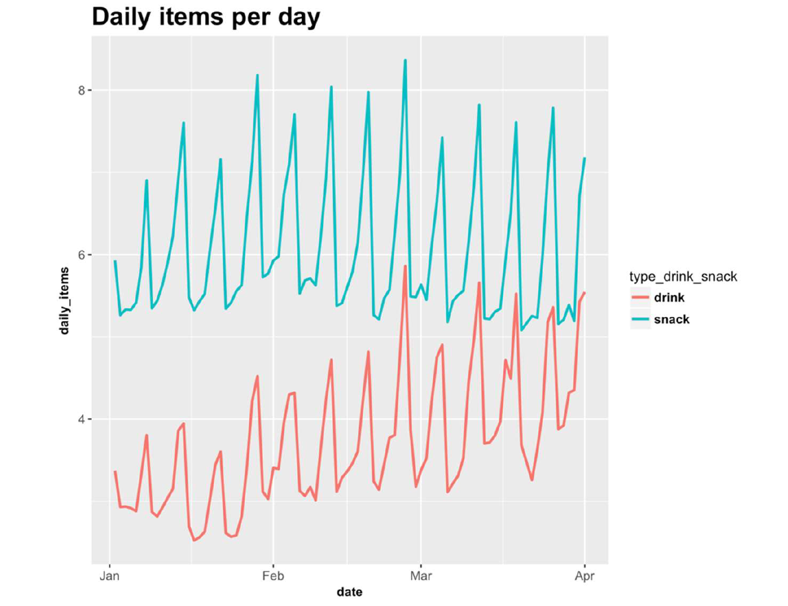

```{r}
# Set working directory
if (!is.null(parent.frame(2)$ofile)) {
  this.dir <- dirname(parent.frame(2)$ofile)
  setwd(this.dir)
}

## Load library ----
library(tidyr)
library(data.table)

### Read dataset ----
machine = fread('machine_data.csv') 
transaction = fread('transactional_data.csv') 
product = fread('product_data.csv') 
```


** 1. General overview of the data **

Machines:
a. How many machines are there?
```{r}
print(uniqueN(machine$machine))
```

b. What percentage of them are small?
```{r}
machine[,.(.N), by=small_machine][small_machine == 1, N]
```

c. How do they distribute in terms of location type i.e. transport, petrol station?
```{r}
machine[,.(.N), by=location_type ]
```

Products:
d. How many products are there? Which category has the highest number of products?
```{r}
uniqueN(product$product_name)
product[, .(count = .N), by = category][count == max(count), category]
```

e. Which category has the highest and lowest average price? And within snacks or drinks?
```{r}
product[, .(avg_price = mean(price)), by = category][avg_price == max(avg_price)| avg_price == min(avg_price),category]

product[type_drink_snack == "snack", .(avg_price = mean(price)), by = category][avg_price == max(avg_price)| avg_price == min(avg_price),category]

product[type_drink_snack == "drink", .(avg_price = mean(price)), by = category][avg_price == max(avg_price)| avg_price == min(avg_price),category]
```

Transactional data:
f. Restricting the transactional data to March 2017, what’s the average daily items among small and big machines?. 
Why do you think there is such a difference? Give at least 2 possible reasons.
```{r}
merged_DT_all <- merge(merge(transaction, product, 
                             by.x = "product_name", 
                             by.y = "product_name", 
                             all.x = T), 
                       machine,
                       by.x = "machine",
                       by.y = "machine",
                       all.x = T)

merged_DT_all[month(date) == 3, .(daily_item = .N / uniqueN(date)), by = small_machine]
```
Answer:


** 2. Consider the following plot of the number of items sold per machine and day **

a. Is there a general trend in the number of snacks and drinks as the months progress from January to April? 
Is it the same for snacks and drinks? Why do you think that might be so?

Answer: Based on the graphic we can observe that for the period between January to April, 
the consumption of snacks remains stable, while the consumption of drinks shows a tendency to increase. 
This may occur due to a shift in seasons (the higher temperatures, the higher consumption of beverages). 


b. Is there shorter time period trend as well? Is it the same for snacks and drinks? What do you might be the cause?

Answer:The graphic also shows short time period trends that show peaks and valleys for one vending machine. 
Given that these match between snacks and drinks, we can assume that they happen due to the refill nature 
of a vending machine: the peaks generate when consumption increases when the machine has just been refilled 
because it has more variety of products to offer, and viceversa.


** 3. Given the following distribution of average income: **
```{r}
summary(machine$income_average)
```

a) Are there outliers? How would you treat them? Provide code with your answer
```{r}

```

b) Can you give three possibilities on how to treat the NA cases? Which option you choose and why? 
Provide code with your answer
```{r}
#Zero,Median,Mean
```


** 4. According to the following boxplot, what is the median number of hotels in the machine area? **
```{r}
boxplot(machine$num_hotels, data = data, ylim = c(0,2))
summary(machine$num_hotels)
```
Answer: The median number of hotels in the machine area is 0.


5. In this exercise we will build a location score that tells us what’s the average daily items per machine depending on the location it is placed. This model could be used to
a) Decide in which locations to place new machines 
b) Construct a benchmark for each machine: how much should it sell according to its location? 
This can be used to detect problems in machines (i.e. illumination, bad placement within a station etc.)

For that, you will build a linear model to predict machine daily items using the following
features:
  1. Machine size (big or small)
  2. Income of the area
  3. Number of routes in the area
  4. Number of hotels with 4 and 5 stars in the area
  5. 0-1 Indicator of whether the machine has train_AvgDailyPassengers informed meaning it is a petrol station or other type      of location
  6. Number of other Vendex machines in the area


a. Do all variables show statistical significance? Which ones doesn’t? How do you know?
```{r}
daily_item <- transaction[, .(daily_item = .N/ uniqueN(date)), by = machine]
machine <- merge(machine, daily_item, by = "machine")
target_DT <- machine[, .(income_average, daily_item)]

names(machine)
machine[, petrol_station:=ifelse(is.na(train_AvgDailyPassengers), 1, 0)]
train <- machine[complete.cases(daily_item, 
                               small_machine, 
                               income_average, 
                               total_number_of_routes_600, 
                               num_hotels_45, 
                               petrol_station, 
                               n_density_5km, 
                               num_vendex_nearby_300),]
m0 <- glm(daily_item ~ small_machine + income_average + total_number_of_routes_600 +
            num_hotels_45 + petrol_station + n_density_5km + num_vendex_nearby_300, data = train)
summary(m0)
```
Answer: Not all variables show statistical significance. As we can see in the coefficient column in the summary,
Only "samll_machine", "income_average", "number_hotel_45", and "train" show significance, 
while "total_number_of_routes_600", "n_density_5km", and "num_vendex_nearby_300" do not.


b. Build another linear model but this time instead of using the variables “total_number_of_routes_600 use 
the log of that variable in base 10 calling it “log_transport”. Does this new variable show statistical significance?
```{r}
machine[, log_transport:= log10(total_number_of_routes_600)]
train <- machine[complete.cases(daily_item, 
                               small_machine, 
                               income_average, 
                               log_transport, 
                               num_hotels_45, 
                               petrol_station, 
                               n_density_5km, 
                               num_vendex_nearby_300),]
m1 <- glm(daily_item ~ small_machine + income_average + log_transport +
            num_hotels_45 + petrol_station + n_density_5km + num_vendex_nearby_300, data = train)
summary(m1)
```
Answer: Yes, it does show significance.


Train the model constructed in the previous question (b) removing the
variables that do NOT show statistical significance calling it final_model and
with that model answer the following questions
```{r}
train <- machine[complete.cases(daily_item, 
                               small_machine, 
                               income_average, 
                               log_transport, 
                               num_hotels_45, 
                               petrol_station,  
                               num_vendex_nearby_300),]
final_model <- glm(daily_item ~ small_machine + income_average + log_transport +
                     num_hotels_45 + petrol_station + num_vendex_nearby_300, data = train)
summary(final_model)
```

c. How many daily items less do small machines sell all other factors remaining equal?
```{r}
cof <- summary(final_model)$coefficients
cof["small_machine", "Estimate"]
```

d. What’s effect on machine sales does having other nearby machines all other
factors remaining equal?
```{r}
cof["num_vendex_nearby_300", "Estimate"]
```

e. Ranking all machines according to the final_model, what are the real daily sales of the top 20% machines 
with respect to your model prediction? And the real daily sales of the bottom 20% machines 
according to your model? What’s the top20%/bottom20% ratio?
```{r}
outcome <- predict(final_model)
top_20_pct <- outcome[outcome > quantile(outcome, .8)]
bottom_20_pct <- outcome[outcome < quantile(outcome, .2)]
top_bottom_ratio <- mean(top_20_pct / bottom_20_pct)
top_bottom_ratio
```
Answer: The values of top 20% and bottom 20% are stored in the vectors provided above.
The average ratio of top 20% devided by bottom 20% should is 2.252792


f. Given the following 2 locations for a big machine:
    i.  Supermarket entrance, 2 nearby hotels of 4 stars, 20 transport routes, no
        nearby machines
    ii. Transport station, no nearby hotels of 4 or 5 stars, 10 transport routes nearby, 
        3 nearby Vendex machines
Which location would you choose and why?
```{r}
unique(machine$location_type)
loc_1 <- data.table("small_machine" = 0, 
                    "income_average" = 0, 
                    "log_transport" = log10(20),
                    "num_hotels_45" = 2, 
                    "petrol_station" = 0, 
                    "num_vendex_nearby_300" = 0)
loc_2 <- data.table("small_machine" = 0, 
                    "income_average" = 0, 
                    "log_transport" = log10(10),
                    "num_hotels_45" = 0, 
                    "petrol_station" = 1, 
                    "num_vendex_nearby_300" = 3)
pred_loc_1 <- predict(final_model, newdata = loc_1, type = "response")
pred_loc_2 <- predict(final_model, newdata = loc_2, type = "response")
pred_loc_1 > pred_loc_2

pred_table <- data.table(c(1,2),c(pred_loc_1,pred_loc_2))
pred_table
```
Answer: Choose the first location, since it has better predictive outcome.

Note:Since the estimated coefficient of income_average is infinitesimal, we can put whatever number we want and won't affect the outcome much. Choose the first location, since it has better predictive outcome.
(why is income_avrg an infinitesmal?)


